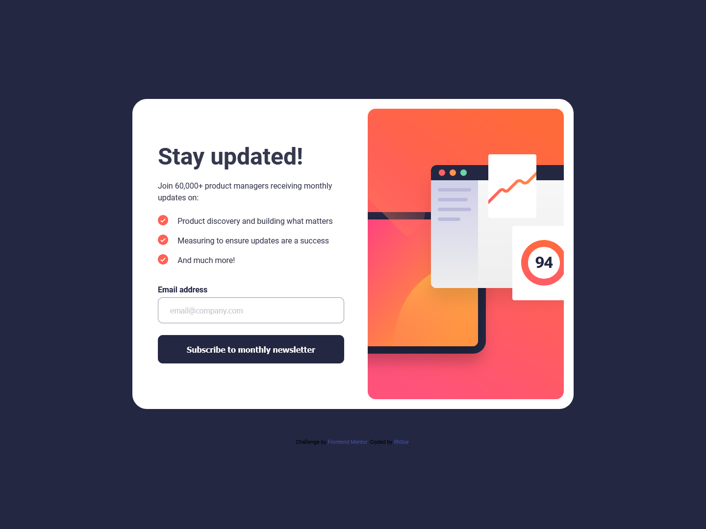

# Frontend Mentor - Newsletter sign-up form with success message solution

This is a solution to the [Newsletter sign-up form with success message challenge on Frontend Mentor](https://www.frontendmentor.io/challenges/newsletter-signup-form-with-success-message-3FC1AZbNrv). Frontend Mentor challenges help you improve your coding skills by building realistic projects. 

## Table of contents

- [Overview](#overview)
  - [The challenge](#the-challenge)
  - [Screenshot](#screenshot)
  - [Links](#links)
- [My process](#my-process)
  - [Built with](#built-with)
  - [What I learned](#what-i-learned)
  - [Continued development](#continued-development)
  - [Useful resources](#useful-resources)
- [Author](#author)


## Overview

### The challenge

Users should be able to:

- Add their email and submit the form
- See a success message with their email after successfully submitting the form
- See form validation messages if:
  - The field is left empty
  - The email address is not formatted correctly
- View the optimal layout for the interface depending on their device's screen size
- See hover and focus states for all interactive elements on the page

### Screenshot
- Desktop View



- Mobile View


### Links

- Solution URL: [solution](https://github.com/rh0se/newsletter-sign-up-with-success-message-main)
- Live Site URL: [live site](https://rh0se.github.io/newsletter-sign-up-with-success-message-main/)

## My process

### Built with

- Semantic HTML5 markup
- CSS custom properties
- Flexbox
- CSS Grid
- Mobile-first workflow


### What I learned
- DOM Manipulation:
The success state, where users see a message after submitting the form, allowed me to practice DOM manipulation. I used JavaScript to dynamically update the content based on user input.

- CSS Styling and Layout:
Adapting the layout for different screen sizes (responsive design) was crucial.

- Dialog Element:
The challenge introduced me to the ```<dialog>``` element.
I explored its usage for displaying success messages and handling user interactions.

- Attention to Detail:
Matching my solution as closely as possible to the provided design helped me train my eye for detail.
I paid attention to fonts, colors, spacing, and alignment.

```html
<dialog>
  <form method="dialog"></form>
  </dialog>
```
```css
  dialog:not([open]){
          display:none;
     }
```


### Continued development
- Responsive Design Refinement:
I’ll practice making my designs more responsive.Testing across various devices and screen sizes will help me create adaptable layouts.

- JavaScript Proficiency: 
I plan to deepen my understanding of JavaScript. Exploring more complex interactions, form validation, and dynamic content will be my focus.


### Useful resources

- [Stack Overflow](https://stackoverflow.com/questions/71652623/cannot-close-dialog-element-with-display-set-to-grid) - This helped me fix the issue of ``` <dialog></dialog> ``` element not closing when its display is set to grid
- [MDN Docs](https://developer.mozilla.org/en-US/docs/Web/HTML/Element/dialog) - This is an documentation which helped understand``` <dialog> ``` element


## Author

- LinkedIn - [Rhoda Ojetola](https://www.linkedin.com/in/rhoda-ojetola/)
- Frontend Mentor - [@rh0se](https://www.frontendmentor.io/profile/rh0se)


